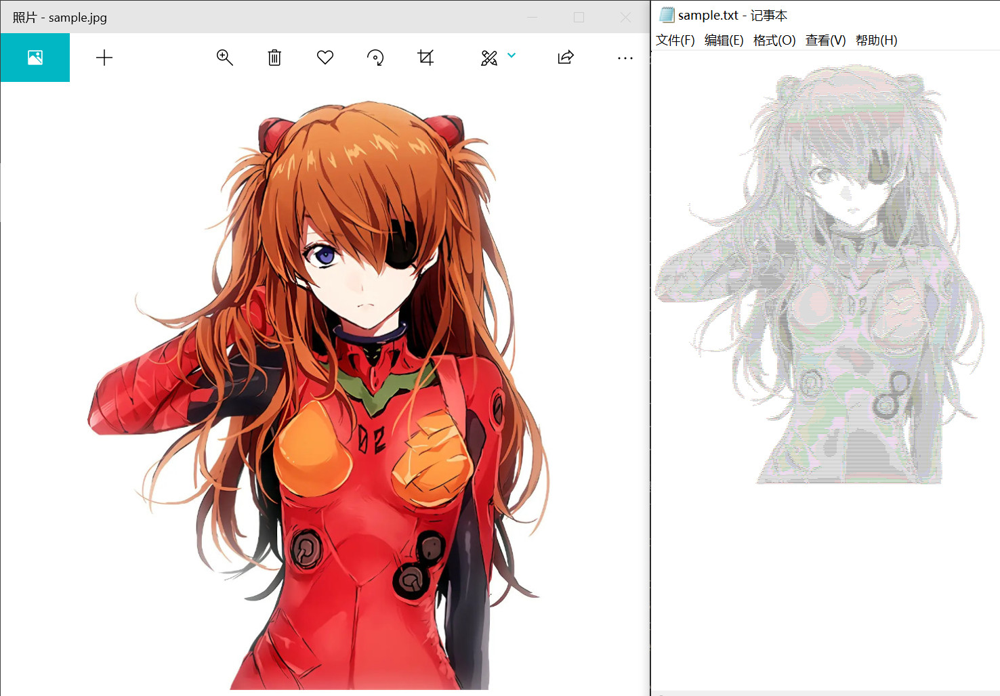

## convert a Image to char set

### 1.Install dependence
```bash
pip install -r requirements
```
### 2.Change the MakeImgTxt.py file entrance img_path to your path
```python
if __name__ == "__main__":
    img_path = r"sample.jpg"
    makeChar(img_path)
    pass
```
### 3.run the python file in termenal
```bash
python MakeImgTxt.py
```
### result




you also can veiw how it Calculate replace chars from font in `CalCharCount.py`